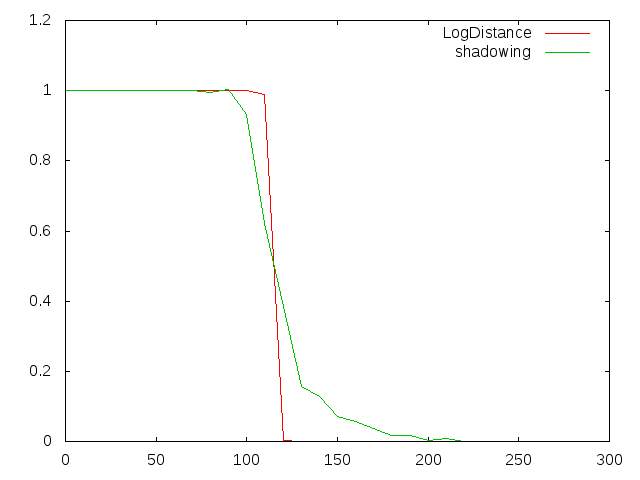

#### PLAYS Camille
###### 13/04/18

# Lab2 : Performance evaluation of EDCA MAC,Modulation and Fading Channels for IEEE 802.11p

## Sender Model: Evaluation of the EDCA 802.11p mechanisms for traffic differentiation

### 1. Simulation of EDCA internal contention


In this simulation, the packet size is fixed and the position of the two cars is fixed as well. We will just modify the value of the data rate and observe the effects on the PRR and the end-to-end Delay.

#### a) PPR function of data rate

We plot the curves corresponding to the PRR (which is the number of received packets at a destination node over the number of transmitted packets) function of the data rate for each class:

PRR of class CAM (background) depending on the data rate

The PRR starts dropping immediately after the data rate exceeds the value of 1 Mbps. The PRR goes from the value 1 (all packets are received at 1 Mbps) at 1 Mbps to a value around 1/3 (only 1 packet out of 3 is received) at 2 Mbps. After 2 Mbps, the PRR keeps decreasing but slower. At 3 Mbps, less than 3 packets out of 10 are received.


PRR of class DENM (best effort priority) depending on the data rate

Here, the PRR stays at the value 1 (all packets are received) from 1 Mbps until 1.5 Mbps. Then it starts decreasing a little: at 2 Mbps, 9 packets out of 10 are received. It decreases faster after 2 Mbps. At 3 Mbps, only 6 packets out of 10 are received.


Comparison of the two curves: The PRR of the CAM packets (background packets) is well more affected by the increase of the data rate than the PRR of the DENM packets (best effort priority). Indeed, they both start with a PRR at 1 for a data rate of 1 Mbps but at 2 Mbps, the CAM packets are only received 1 out of 3 times and the DENM packets are still receives 9 out of 10 times.

#### a) Average delay function of data rate


To compute the average delay, I used the command awk :

```bash
awk '{ s += $2 } END { print "sum: ", s, " average: ", s/NR, " samples: ", NR }' delayXXXX.dat
```

which calculates the sum of all the values from the second column of the .dat file and divides the sum by the number of line in the file, that is to say, the number of values that have been taken in account in the sum.

We plot the curves corresponding to the average end-to-end delay (which is the interval from the time an application generates a packet to the time this packet is received by the corresponding application at another node) function of the data rate for each class:

Average delay of class CAM (background) depending on the data rate


The average delay of CAM packets is almost 0 at 1Mbps and increases to reach 2 at 1.5 Mbps. The delay get stabilized at 3.5 between 2 and 3 Mbps.


Average delay of class DENM (best effort priority) depending on the data rate

The average delay of DENM packets is almost 0 between 1 and 1.5 Mbps. Then it increases until reaching 1.5 at 2.5 Mbps.

Comparison of the two curves: Not only the DENM packets have a better chance to get received but they also arrive faster than the CAM packets.


Comparison between the PRR curves and the end-to-end delay: We observe that for each class, the PRR curve is almost the inverse of the delay curve. Indeed for example for the DENM packets, the PRR is at 1 between 1 and 1.5 Mbps and starts decreasing after and the Delay is at 0 between 1 and 1.5 Mbps and start increasing after.

#### c) Wireshark file

When we observe Qos parameter field in the UDP packets in the pcap file, we can see a binary number corresponding to the priority: either 001 (1) for the backgound packets: CAM or 011 (3) for the best effort packets: DENM

### 2. Simulation of general contention


Compared to the previous question, here we want to evaluate the impact of a network load. We measure the PRR of node 0.

#### a) Variation of Average PRR function of the data rate with 10 sources


Average PRR of 10 sources for CAM Packets

The PRR decreases very fast from 0 to 0.5 Mbps and its value is almost 0 at a data rate of 0.5 Mbps.

Average PRR of 10 sources for DENM Packets

The PRR decreases fast as well. At 1 Mbps, we can only receive 1 DENM packet out of 5 in this loaded network.

Conclusion: the load of the network has a really negative impact on the PRR. Indeed it's almost impossible to receive CAM packets with a data rate higher than 0.5 Mbps whereas without any network load (1st simulation with only one sender and one receiver) the PRR of the CAM packets was 1 (all packets received) for a data rate of 1 Mbps. The Denm packets are really affected as well. For a data rate of 1 Mbps, we only receive 1 packet out of 5 in a loaded network compared to receiving all DENM packets with only two cars.


## Fading Models: Evaluation of the impact of shadow fading and fast fading on communication performance


### 1. log-distance fading



#### a) What can you see

In the log-distance channel model, there's a distance for which the probability of reception goes from 1 to 0 almost instantaneously (for a distance of 120). Therefore there is a clearly-delimited area around the car where the packets can be received. This model doesn't seem very realistic for a wireless communication.

### 2. Log-normal shadowing

The reception fades earlier (around a distance of 100) than the log-distance but reaches 0 way later. It seems more realistic as the decreasing phase is not as instantaneous as for the log-distance.

### 3. Nakagami


The reception start fading earlier than the log-normal (around 80). Among the Nakagami models, we can observe that when we increase the value of the parameters, the curves starts decreasing later and have a wider range of good signal reception. The Nakagami-mix is the worse since it start decreasing early and fast compared to the others.

The impact on the properties of a wireless link is that the reception of packets gets very bad very fast after reaching a certain distance (around 70). Therefore, it becomes impossible to communicate after reaching this distance.

## Modulation and Coding: Evaluating the impact of the choice of the modulation scheme


### 3. PRR of several modulation schemes as a function of distance


#### a) Observations
For a high data rate scheme, the PRR is high but on a short distance whereas for a low data rate scheme, the PRR is low but on a long distance.

#### b) Trade-off

The trade-off engineers have to make is the trade-off between the level of PRR and the distance on which this level is maintained. Indeed, according to the curve, the higher the PRR is, the shorter the distance of communication is. Choosing the highest PRR would be a mistake because the distance on which the packets can be transmitted successfully is very small (about 30 for the 64 QAM - 27 Mbps scheme) even if the communication would be great for very short distances but choosing the lowest PRR in order to have the longest distance of communication possible would probably be a mistake too because the ratio between the number of packets received over the number of packets sent would be low even at the shortest distance. The trade-off would be to chose a scheme in the middle, with a correct PRR covering a reasonable distance.


### 2. Channels with path loss, shadowing and fast-fading


#### a) Observations
The fading seems to make the curves decrease sooner but make them reach a value of 0 later. For example, the 27 Mbps scheme has a PRR of 0 without fading but a value between 0 and 1 with fading.

#### b) Difference of impact between curves

The curves seem to be more or less impacted the same way by the fading. However, the curves with the highest PRR seem to lose its interest even more because it drops immediately, so even at short distances, the signal fades away very quickly.
