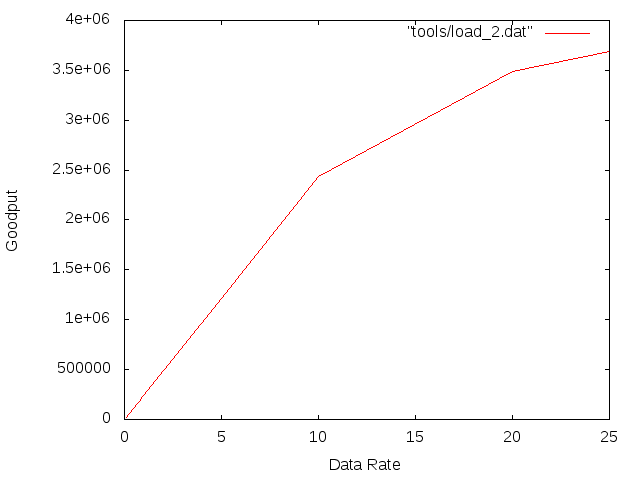
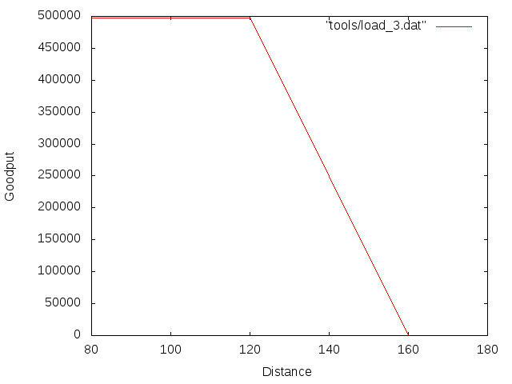

# Lab1

## Part1 : Impact of network load on the performance of IEEE802.11 MAC protocol

### load 1

For a fixed number of 3 nodes in the network at a fixed distance, we will study the evolution of the goodput (the number of useful bits per unit of time forwarded by the network to a certain destination) depending on the data rate.
The graph shows that the goodput is linear for a data rate from 0.1 to 0.8 Mbps, then slows down from 0.8 to 0.9 Mbps and starts to saturate from 0.9 Mbps.
From 0.9 Mbps, increasing the data rate becomes inefficient since the goodput is increasing very slightly between 0.9 and 1Mbps.
Once the data rate reaches 2 Mbps, the channel will be saturated and it will be useless to increase the rate since it won't increase the goodput.

We can assume that the goodput slows down after reaching a certain value of data rate since there are more and more collisions. The channel reached a maximum goodput value for data rate of 2 Mbps.

### Load 2

This scenario is similar to the first one except that we increased the value of the saturation point of the channel (from 2Mbps to 54 Mbps). In both cases, we stoped the data rate value at half the saturation point. In this scenario, the goodput starts slowing down when we reach a data rate value of 10 Mbps and slows down even more after 20 Mbps. Comparatively to the data rate saturation point, the goodput of the second scenario start slowing down faster but doesn't start saturating as fast as for the first scenario.

## part2 : Hidden nodes problem

### RTS/CTS handshake disabled below 2200 bytes

#### b) From Node_1 point of view:

Node_0 transmits data (UDP) blindly to node_1, thinking the way is cleared since it doesn't detect the transmission of node_2. The same thing applies to node_2. Therefore, node_1 receives data from both sides. If the two nodes transmit exactly at the same time, the worse case, Node_1 can't decode any of them and the packets don't even appear on the PCAP file. The two nodes transmitting will try to transmit the same message again and again until it is acknowledge by Node_1 (on the PCAP file, node_1 sends an acknowledgment packet). We can only see the packets that are effectively received and decode by node_1 on the PCAP file.

#### c) From Node_0 point of view:

Node_0 only receives packet from Node_1 (acknowledgment). It sends data packet (UDP to node_1). On the PCAP file from node_0 point of view, we can see all the attemps to send the message that we couldn't see from node_1 point of view. At the end, all packets will be received by node_1 but it is very inefficient since the number of packets that nodes have to resend due to collision is huge.

#### d) Detection of hidden node

We can observe collisions on the PCAP trace of node_0 since we see some packets that are not acknowledge by node_1 and therefore resent with the same sequence number.

#### e) Throughputs

   Throughput from node_0 to node_1: 0.233557 Mbps
   Throughput from node_2 to node_1: 0.338912 Mbps

   Those throughput (message received / message sent) are very low. It corresponds to approximately 4 tries to send one message.

### RTS/CTS handshake enabled above 150 bytes

#### b)From node_1 point of view:

There are some new types of packets: Request to send from node_0 to node_1 or node_2 to node_1 and clear to send from node_1 to node_0 or from node_1 to node_2. This handshake (if concluded) between two nodes allows them to take over the channel and transmit correctly without being interrupted.

#### c)From node_0 point of view:

The same handshake process is visible. Some request to sent messages are visible on this PCAP file and not visible from the node_1 point of view: this means that those messages weren't received by node_1. Also, we can see some clear-to-send messages addressed to node_2 visible on node_0 PCAP file. This means there is a handshake happening between node_1 and node_2 and node_0 is aware of it and won't transmit. Node_0 waits a certain amount of time before resending a request to send again to node_1. If node_1 is still talking to node_2, it will ignore the request. Node_0 sends regular request to send until it receives a clear-to-send message back from node_1.

#### d) detection of hidden node

we can observe the presence of a hidden node on the PCAP file of node_0 when a packet clear-to-send is received from node_0 but addressed to node_2. When receiving this packet, node_0 understands node_1 is communicating with another node which is node_2.

#### e) throughputs

  throughput from node_0 to node_1: 0.729867 Mbps
  throughput from node_2 to node_1: 0.599125 Mbps

Those throughputs are about two times better than the ones we had without the RTS/CTS handshakes.

### conclusion

Thanks to the RTS/CTS handshake, nodes verify that it is ok to send multiple packets before they do in order to avoid successive collisions. The handshake starts being efficient when set to a certain amont of data (indeed it is not optimized to do the handshake if a node only has to send one packet since it can send it again easily). By taking over the channel, a successful handshake allows a node to send data without being interrupted. By limiting the number of collisions, the RTS/CTS handshake increases the throughput between nodes in a network.

##  Part3 : distance and packet size impact

### packet size of 2000 and bit rate of 0.5 Mbps

#### b) analyse of diagram

 The goodput is stable for a distance between 80 and 120. When Node_2 is further then 120 from node_0, the goodput starts dropping and when Node_2 reaches a distance of 160, the goodput is null.

#### c) number of packet lost depending on position

position | number of packet lost
- |:-: | -:
80 | **1**
100 | **1**
120 | **141**
140 | **281**
160 | **281**
180 | **281**

#### d) maximum of packet loses

The distance for which there is a maximum of packet loses without being out of range is 140.

### packet size of 150 and bit rate of 0.05 Mbps
